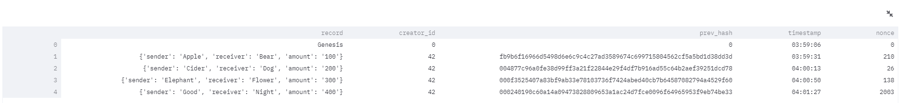
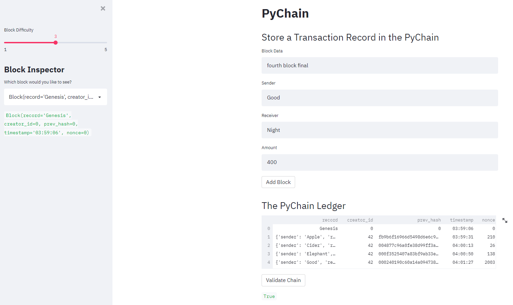

# Challenge18

# Blockchain

This Python file builds a blockchain-based ledger system, and completes with a user-friendly web interface. This ledger should allow partner banks to conduct financial transactions (that is, to transfer money between senders and receivers) and to verify the integrity of the data in the ledger.

---

## Technologies

This project leverages Python 3.7, its library Streamlit, Pandas, hashlib, typing, and dataclasses with the following packages and dependencies:

* [pandas](https://pandas.pydata.org/) - An open-source data analysis and manipulation tool

* [streamlit](https://streamlit.io/) - Streamlit turns data scripts into shareable web apps in minutes

* [hashlib](https://docs.python.org/3/library/hashlib.html) - Secure hashes and message digests

* [typing](https://docs.python.org/3/library/typing.html) - Support for type hints

* [dataclasses](https://docs.python.org/3/library/dataclasses.html) -  Provides a decorator and functions for automatically adding generated special methods

* [datetime](https://docs.python.org/3/library/datetime.html) -  Supplies classes for manipulating dates and times

---

## Installation Guide

Python 3.7, pandas, streamlit, and VS Code are required to be installed before running the application.

`pip install streamlit`

---

## Usage

To run the application simply clone the repository and run the **pychain.py** with:

```
streamlit run pychain.py

```

Attached screenshot below shows the report result:

Below is a screenshot that contains a blockchain consisting of several blocks

  

Below is a screenshot of the Streamlit application page displaying “Blockchain is Valid.”

  

---

## Contributors

Brought to you by Christine Guo (www.linkedin.com/in/christine-guo)

---

## License

NoNe